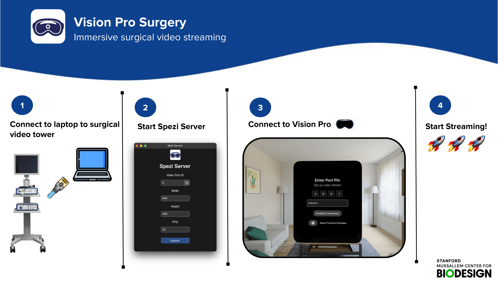
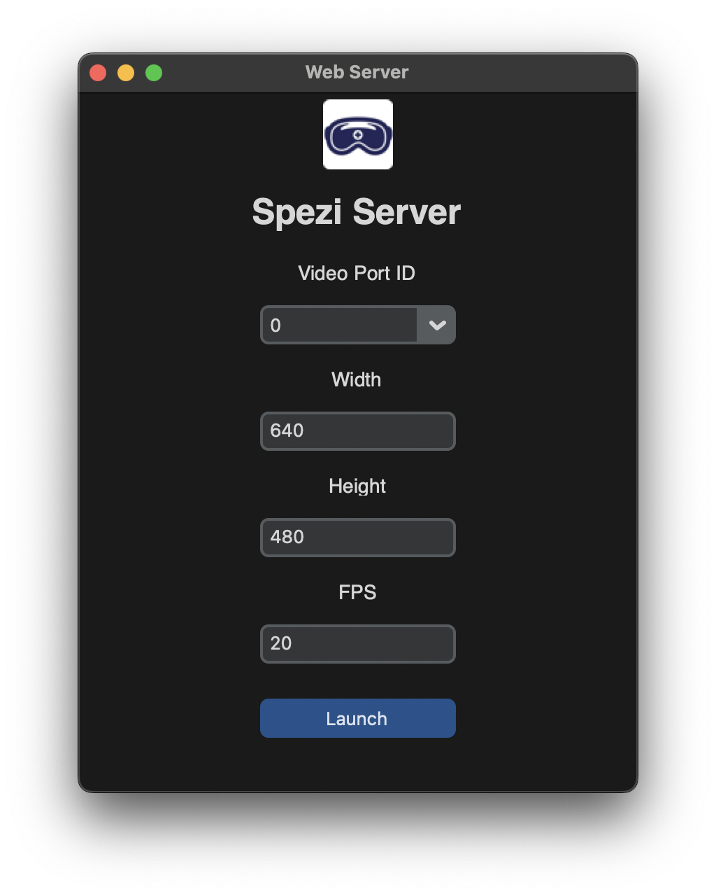
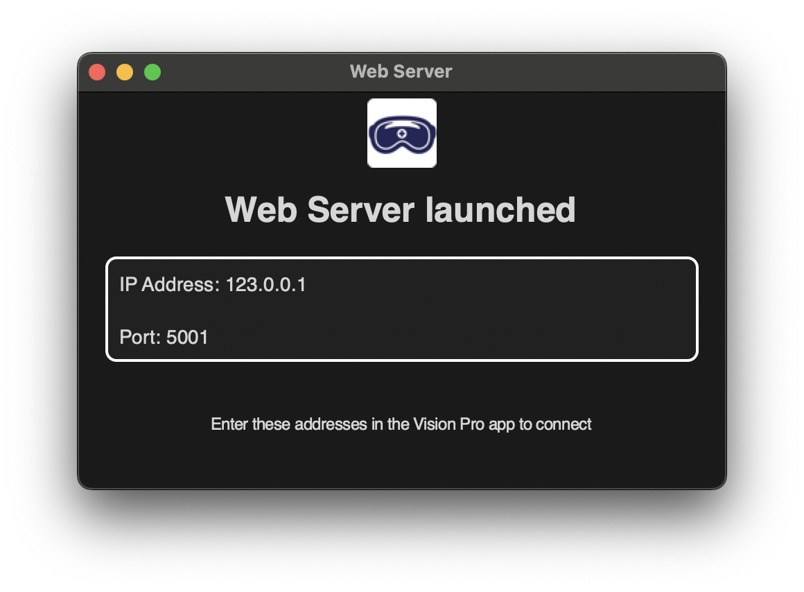

<!--

This source file is part of the StanfordBDHG VisionProSurgery project

SPDX-FileCopyrightText: 2024 Stanford University

SPDX-License-Identifier: MIT

-->

#  Vision Pro Surgery

[](https://github.com/StanfordBDHG/VisionProSurgery/actions/workflows/build-and-test.yml)
[](https://codecov.io/gh/StanfordBDHG/VisionProSurgery)
[](https://zenodo.org/badge/latestdoi/587923964)

<p float="left">
 
</p>

## Overview
The Stanford BDHG **Vision Pro Surgery** repository contains two applications which together enable streaming of surgical video tower feed to the Vision Pro. The objective of this project is to allow for immersive and dynamic viewing of video feed during surgical procedures.

The repository consists of a **Spezi Server** app which enables users to interface their computers with a surgical video tower and start a local network video stream. The **Vision Pro Surgery** app enables fast and easy connection to the live video stream on the Vision Pro headset. 

## Required Hardware and Setup
To get started, you will need to have the following hardware components:
1. **Computer** (Mac or Windows)  
   Used for running **SpeziServer** app
2. **[Vision Pro](https://www.apple.com/apple-vision-pro/)**  
   Used for running **VisionProSurgery** app
3. **Bidrectional Cables**
   - VGA to HDMI ([product recommendation](https://www.amazon.com/Amazon-Basics-Adapter-Cable-1-Pack/dp/B014I8UQJY/ref=sr_1_1?crid=1XTFPLUE35QHW&dib=eyJ2IjoiMSJ9.bbBAqhyMUGKrRbBBvLGSXcfIulzND4uhIq9MYCGLenGGkXTWU0oxlrTh1C7I2ZaQoR_x6HoPXC6wJWR0-EutcMK3OVqPVUdurhcDcjIgUquqUYIh_DA_tlmT0Zg_BAm3atFZ7UH4FMfzMgF97ecdVWHbsW_hfaOid4EGcOluMSU1W6csWsESCvTCDJGvCCWodMKVZLdDViO5Hlul5tW1ZQhh7v-On0q-gxnIfvJHdyc.8aizV0sffmUA6SRTPbncWGNcgNs1ERzODdw_dKDydOY&dib_tag=se&keywords=bidirectional%2BDVI%2Bto%2Bhdmi%2Bamazon%2Bbasics&qid=1731803403&sprefix=bidirectional%2Bdv%2Bto%2Bhdmi%2Bamazon%2Bbasics%2Caps%2C122&sr=8-1&th=1))
   - DVI to HDMI ([product recommendation](https://www.amazon.com/Amazon-Basics-Adapter-Cable-1-Pack/dp/B014I8UQJY/ref=sr_1_3?crid=19EDU0Q1SR10V&dib=eyJ2IjoiMSJ9.fV4ZXtAVPq28yi_hxLQTyhEzIEFJiiDAkaU1nCEjGK3qoduZH1q66PPEDDdf4cc9Gtjthyx9phGUHo5FFJowcI9plEQdCcAKWY_167PDiAEoBdQt37FcCQqM9UVB6thvpuWyxjE8qte6RtpB-84u2_nK5Ph2d4ty4NC937Cz2zYesxVRfiKPzNj8i4q6UoEzafkwv2aA5wDicJPVpzAMQh9MDY2H8NfJS8iqCur0X74.v4I960Em13PIuFsOQaO2BfJXoElHot8_BvyFCM-bKd4&dib_tag=se&keywords=bidirectional+vga+to+hdmi+amazon+basics&qid=1731803318&sprefix=bidrectional+vga+to+hdmi+amazon+basics%2Caps%2C134&sr=8-3))  
4. **4K Capture Card** ([product recommendation](https://www.amazon.com/Capture-1080P60-Streaming-Recorder-Compatible/dp/B08Z3XDYQ7/ref=sr_1_1_sspa?crid=41CJ3H7PNSWK&dib=eyJ2IjoiMSJ9.5LhqAZbayJDt8SZj3Bavc-UhWNExK9aJbSP-Oiw6EDwwMN23cdpgd9Qr7xbZ-cnAhBeSgCbZ4AZb8Ghq33gYc_9__4mdqzDmZlo7pQTI9vBnADCMBvWWWJAb7kOe_vNqm5tB3oDTZA4LO5yK14bJay6CdZBQDS3jLVlsjcHkLdTHyzjDl865bUaViq45rBLxzcL1RB-Y8q2rypki9vlaCtFmkp3Y5oL8jzpAbOSVPKw.V65zMHmCehg_O6BwnB-0_1CbkYhUj63dfjaVcDDBZLA&dib_tag=se&keywords=hdmi+capture+card+4k&qid=1731803447&sprefix=hdmi+capture+card+4%2Caps%2C170&sr=8-1-spons&sp_csd=d2lkZ2V0TmFtZT1zcF9hdGY&psc=1))

> [!NOTE]
>
> - Please check the ports on your surgical video tower, some use VGI out and others DVI out.
> - If you are using a Mac, use a 4K Capture Card that goes from **HDMI --> micro-hdmi**
> - For Windows, use a 4K Capture Card that goes from **HDMI --> USB**
> - We recommend purchasing this 4K Capture Card that works for both platforms: [Capture 1080P60 Streaming Recorder (Amazon)](https://www.amazon.com/Capture-1080P60-Streaming-Recorder-Compatible/dp/B08Z3XDYQ7/ref=sr_1_1_sspa?crid=O64DRHSRVM7N&dib=eyJ2IjoiMSJ9.cCwrrm7emcy8GIgy9ZzjP5Y6B3yxYPaHMirGz0jJWTwLvMCLCN8MCpUSYiAVCisW5noYUh2hLNOhAr2qe_tkxfEu8audXN8g_32X-om8ttoO108fnSkwvz-8rkscsyDt1X5qDATWHYfH7gsHAUeJrrWKbKu8HUhcI17rssMfhcvEmEI1y-fGHPF4LOjkmIw4Ly3ZG9Idwt2ohppyOsPtlE0EPQUcf93Bsjq6nUYeg1g.AyxzX_oM36kNN2GYfX_ThfnkkePiCkkKoLFtRi2_7oY&dib_tag=se&keywords=hdmi+capture+card+for+windows&qid=1731794896&sprefix=hdmi+capture+card+for+windo%2Caps%2C146&sr=8-1-spons&sp_csd=d2lkZ2V0TmFtZT1zcF9hdGY&psc=1) 

## Software Installation and Setup

**Step 1: Downloading Repository**

```bash
git clone https://github.com/StanfordBDHG/VisionPro/
```
**Step 2: Installing Spezi Server Dependencies**

```bash
pip3 install -r /SpeziServerApp/requirements.txt
```

**Step 3: Launching Spezi Server App**

Open the Spezi Server app using one of the [executable files](https://github.com/StanfordBDHG/VisionProSurgery/tree/v1/SpeziServerApp/Executable)
  or by running:
```bash
python3 /SpeziServerApp/spezi_server.py
```

**Step 4: Launching Vision Pro Surgery app**

Open the Spezi Vision Pro app ([VisionProSurgery.xcodeproj](https://github.com/StanfordBDHG/VisionProSurgery/tree/v1/VisionProSurgery.xcodeproj)) through the [Xcode](https://developer.apple.com/xcode/) simulator or by running it on a physical Vision Pro ([learn more here](https://developer.apple.com/documentation/xcode/running-your-app-in-simulator-or-on-a-device)).

## Starting Video Stream
On the launch screen of the Spezi Server app as shown below, you can configure the following settings:

1. **Video Port ID**: this depends on the video stream and varies based on the surgical video tower output
2. **Width** and **Height**: this will determine the size/resolution of the video stream that will be recieved by the Vision Pro
3. **FPS (frames per second)**: adjust for smoother video viewing

> [!NOTE]
>
> - Increasing the FPS/width/height can lead to more delays and higher latency in video streaming
> - For higher FPS and resolution, you will need a very stable WiFi connection

<p align="center">
  
</p>

> [!WARNING]
>
> - Before starting the stream, ensure that your computer is connected to a WiFi network that the Vision Pro can also be connected to
> - Both devices will need to be on the **same WiFi** for video streaming to work


<p align="center">
  
</p>

After launching, the SpeziServer app will show you the **port** and **IP address** that you will enter into the Vision Pro for connection.

## Connecting Vision Pro to Video Stream

After running the Vision Pro app on either the simulator or physical device, you will be presented with the start screen as shown below. 

<p align="center">
  
</p>

After tapping on _Get Started_, you will get to the set-up screen where you have to enter your **port number** and **IP address**.

<p align="center">
  
</p>

> [!NOTE]
>
> - You will find your local port number and IP address from the Spezi Server computer app ([see "Starting Video Stream"](#starting-video-stream))

### Contributors

You can find a list of contributors in the `CONTRIBUTORS.md` file.
